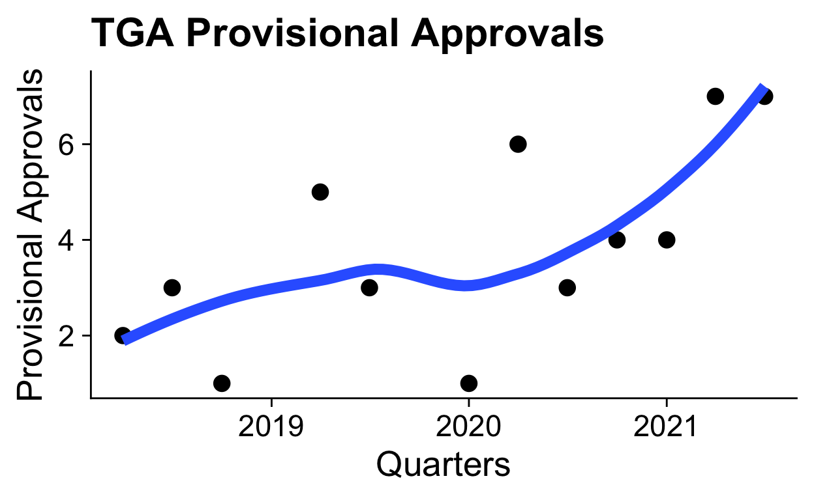

Drug Safety & Australia’s Digital Health Infrastructure

## Missing Data and Missing the Mark

John wakes up one morning with sharp chest pains, which he dismisses as just another nuisance pain and tries to get on with his day. But his wife notices the grimace on his face and instantly recognises that this is definitely something different. She eventually convinces him that this was not something he should dismiss, particularly given that he had the Moderna Spikevax COVID-19 vaccine only 7 days ago. She calls an ambulance and John is taken to a small regional hospital. The nurse seeing him at triage instantly recognises the concern and a troponin level is ordered. This comes back highly elevated and the treating doctor diligently reports this to the Therapeutic Goods Administration (TGA) as a potential case of vaccine-associated myocarditis. Because John needs cardiac monitoring, he is transferred to a larger suburban hospital in the nearest city. Once there he undergoes an angiogram, where they identify a moderate-sized blockage in one of the vessels of his heart. The blockage is from a cholesterol plaque, which has likely been there for many years, but has slowly grown and eventually ruptured to cause a heart attack. The cardiologist places a stent in the artery to open up the blockage and John is quickly discharged so he can return home to recuperate. The report to the TGA remains, unedited, unamended, unaware of all that has happened since.

Now contrast this with Lisa. Lisa is an accountant at a large bank. Many years ago, when she was working her way up through the corporate ladder, she had what she calls “the forgotten year”. It was a year of feeling constantly tired, noticing weird rashes, debilitating joint pains and endless trips to many doctors before she was eventually diagnosed with systemic lupus erythematosus (SLE), an autoimmune condition that can affect almost any part of the body. Pham tried a few different medications, before she was eventually enrolled in a clinical trial. This new medication was novel and experimental at the time, but it seemed to work better than the others. In fact, it worked so well that the trial was successful and the drug was eventually approved by the TGA. Fast forward 8 years, Lisa’s SLE has remained in remission. She has been in good health, although she has started noticing a tremor in her hand. Eventually, the tremor gets worse and she sees her GP, who orders some tests and refers her to a neurologist. She is eventually diagnosed with a movement disorder, a broad category of disorders, including Parkinson’s disease. Nobody reports this to the TGA, no known link exists and she has been on this medication for 8 years. But there are 100s of people around the world slowly developing these symptoms, all in isolation with nobody to connect the dots. Eventually, this signal is detected and a warning is introduced. After many years, a gene is identified that predisposes to this risk. But 100s more cases occur before this is known and testing is implemented.

What both of these (fictional) cases illustrate is a failure. Not a failure of individuals, but a failure of a system. Pharmacovigilance is the “science and activities relating to the detection, assessment, understanding and prevention of adverse effects or any other medicine/vaccine related problem.” [1] Whilst pharmacovigilance is a necessary part of the drug development phase, many safety signals are too rare (less than one in one thousand) or too delayed to capture in a clinical trials — and this is becoming even more critical as provisional approvals increase, meaning drugs being released with less data and for a smaller patient population where every scrap of data counts (see figure below on provisional approvals). So we must turn instead to what happens after a drug goes to market and identify these safety signals when it is already in use. For such a critical component in the safe development of new and novel medications, one would expect a sophisticated, well-resourced infrastructure that leverages all the advantages of our digital health systems. What we see instead is nothing. Fragmented systems and a lack of vision has lead to a complete void.

## The Current Landscape

The Therapeutic Goods Administration (TGA) in Australia collates post-marketing adverse drug event reports in a central database. This is the Rome of pharmacovigilance – all roads must lead here. But what about the roads? What if I told you there are no roads? Everyone must beat their own path to Rome. All reports to the TGA are human-generated, ad-hoc and one-way. An individual reports to the TGA when they feel it is appropriate, with whatever information they have in hand, with no method to update, refine, revise or review. Some of these reports are highly vetted by expert hospital pharmacovigilance committees, some might be completely fraudulent. None are linked with hospital electronic medical records, Pharmaceutical Benefits Scheme (PBS) prescription data or GP practice management software. Even if they were, none of these systems are linked to eachother, so that a case like John’s would have no information from his subsequent angiogram at another hospital. Good luck finding your way to Rome.

The failings in pharmacovigilance reflect the broader failings in digital health. Australia boasts a world-class public health system, with the PBS at the centre of a unified medication landscape. But this unified funding has failed to yield unified digital health systems. My Health Record is an antiquated attempt to bridge these systems. It is a highly incomplete central record of some aspects of healthcare. On an individual level, it sometimes contains some of the information necessary for safe, effective patient care. On a broader level, it provides none of the infrastructure necessary to perform the large scale research needed to improve our knowledge in areas like medication safety and COVID-19 epidemiology.

> I just got a foot ultrasound, asked for a copy of the report and if it would be uploaded to [@MyHealthRec](https://twitter.com/MyHealthRec?ref_src=twsrc%5Etfw)
> Reply: it is company policy to NOT share the results with the patient nor upload it to My health Record 😱 [@AuDigitalHealth](https://twitter.com/AuDigitalHealth?ref_src=twsrc%5Etfw) [@TheInstituteDH](https://twitter.com/TheInstituteDH?ref_src=twsrc%5Etfw)
>
> — Daniel Capurro 💉💉💉 (@dcapurro) [February 23, 2021](https://twitter.com/dcapurro/status/1364010140991516676?ref_src=twsrc%5Etfw)

## What the Future Might Look Like

The US Food and Drugs Administration (FDA) has recently begun grappling with the failed infrastructure of pharmacovigilance. The FDA Sentintel System was developed as a way to integrate insurance databases into their pharmacovigilance program. More recently, the technical shortcomings of insurance databases has lead to investment in a new approach, integrating these insurance databases with large electronic health records (EHRs) in a first step towards building something resembling an integrated digital infrastructure [2]. It should be a great source of shame that Australia, with a mostly public health system, is lagging so far behind our privatised and fragmented cousins in the north.

The first steps towards a digital infrastructure that works for better healthcare is data linkage. Adverse drug events are inherently longitudinal, requiring the full breadth of data to be linked across various systems, so that the identifcation of an adverse drug event can be correlated with the initiation of a medication in hospital, or the first script recorded on the PBS. The PBS itself is a notorious black hole for data, taking in the majority of Australia’s prescription medicine data and linking none of it to healthcare records. Contrast this with the proposed Sentinel System, where many private insurance databases will link insurance-funded script data with private EHR data. The ability to link data across jurisdictions, systems and corporate structures must make us reflect on the failings in our own system, which ought to have fewer barriers to overcome.

Linked data is only the start, and we will need to invest in developing the sophisticated tooling to take advantage of this. But at least in this aspect we possess the expertise and desire to fill the gap, to modernise pharmacovigilance and meet the needs of the current and future landscape of drug development.

[1] Pharmacovigilance, [https://www.who.int/teams/regulation-prequalification/regulation-and-safety/pharmacovigilance](https://www.who.int/teams/regulation-prequalification/regulation-and-safety/pharmacovigilance).

[2] Desai RJ, Matheny ME, Johnson K, et al. Broadening the reach of the FDA sentinel system: A roadmap for integrating electronic health record data in a causal analysis framework. _NPJ digital medicine_ 2021; 4: 170.
