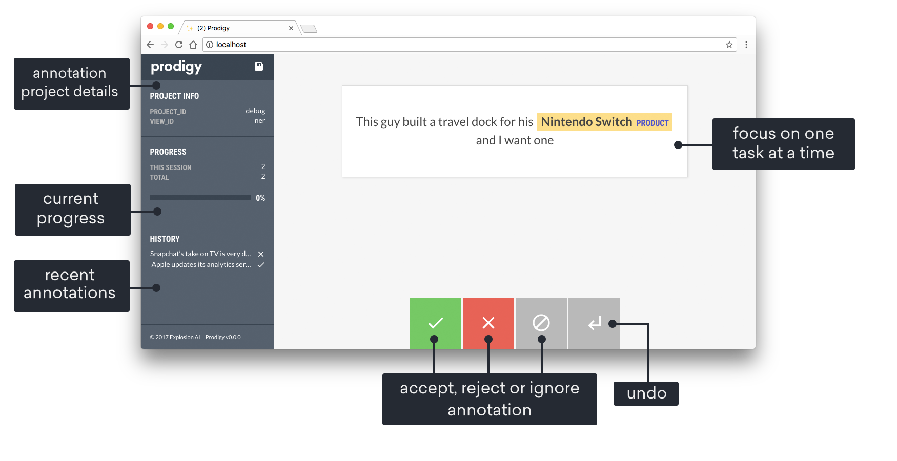
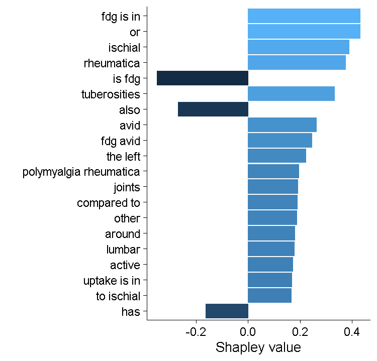

Machine Learning To Get Stuff Done

I tend to think that there are three categories of machine learning problems. Sometimes machine learning can be really expansive, using sophisticated tools to forge new ground in science. Sometimes it can be incredibly powerful, building large-scale models to perform complex tasks. And sometimes, it can just be the most efficient way to get things done. This is an example of that last category.

### Problem

I have a project that falls into categories 1 & 2, but in order to do that I need data. Specifically, I need PET-CT scans with features of polymyalgia rheumatica (PMR). But how would I find these? Nobody records this data, it doesn’t exist in a structured, searchable form. But we do have reports — these might technically be searchable, but I don’t think I can easily devise a search term that will capture all the different ways that PMR can be described on a PET-CT report (including many instances where some classic features are described but the words “polymyalgia rheumatica” never appear in the report).

### Solution

I chose to tackle this as a machine learning problem. Specifically, a supervised learning problem. But to do this I needed data. The first step is always to collect data.

### Data Collection

I needed a collection of PET-CT reports and I needed labels for this reports. I originally thought that I would label words and phrases within the reports to do _named entity recognition_ , a task that involves training a model to identify these features in text. But there are many potential PMR features noted in PET-CT reports, making this a fairly time-consuming process. Instead I settled on simply classifying the reports as either **PMR** or **Not PMR**.

To generate this data, I turned to my data annotation tool [prodigy](prodi.gy). I wrote a custom data loader using an SQL query and some python code to trim the reports so they just contained the reporting physicians notes and conclusion — this last step is necessary because the text of the original request can bias the model and ultimately doesn’t contain information about the PET-CT itself. This code pulls PET-CT reports directly from our research data warehouse one at a time, so no intermediate step is required to generate a large CSV file or spreadsheet. You can try a demo of prodigy [here](https://prodi.gy/demo) — it has a clean, intuitive interface and is a breeze to customize for specific tasks.

An example of the prodigy interface.

### Training an Initial Model

I originally trained a quick model in R to obtain a baseline and confirm that this was all feasible. For this I generated skip-grams (n=3, k=1) and performed **term frequency–inverse document frequency (TF-IDF)** to obtain the features. The very quick explanation of this is that I pulled out single words and clusters of up to three words (the skip part means that those words do not have to be adjacent, but may be separated by 1 word), I then counted how many times these skip grams occurred in each report and normalised this by the frequency across all reports (so that infrequent skip grams carry more value). I then trained a XGBoost model on these features to classify reports as being either **PMR** or **Not PMR**.

```
library(tidyverse)
library(tidymodels)
library(textrecipes)
library(fastshap)

# Split the data into trian and test
split <- initial_split(data = data, strata = pmr, prop = .8)
train <- training(split)
test <- testing(split)

# Specify the recipe that creates skip grams, retains only the 1000 most common skip grams, then performs TF-IDF
rec <- recipe(pmr ~ text, data = train) %>%
  step_tokenize(text, token = "skip_ngrams", options = list(n_min = 1, n = 3, k = 1)) %>%
  step_tokenfilter(text, max_tokens = 1000) %>%
  step_tfidf(text)

# Specify the xgboost model with some hyperparameters
model <- boost_tree(trees = 1000, 
                    mtry = 10, 
                    min_n = 3,
                    tree_depth = 5) %>%
  set_engine("xgboost", eval_metric = 'error') %>%
  set_mode("classification")

## Connect the recipe and model in a workflow
wf <- workflow() %>%
  add_recipe(rec) %>%
  add_model(model) %>% 
  fit(train)

## Specify the metrics we would like to report
model_metrics <- metric_set(roc_auc, pr_auc, accuracy)

## Trian the model on the train set and test on test set (as specified by split)
res <- last_fit(wf, split, metrics = model_metrics)
```

This model has an AUC of about 0.95 and an accuracy of just over 90% — a pretty good start! Examining the Shapley values (a way of estimating the contribution of each skip gram to the model prediction), it seems to be using some of those PMR features (particularly ischial tuberosities), but there probably some spurious features here. My feeling is that this model will probably suffer from over-fitting.

Shapley values from the XGBoost model.

### Training a Transformers Model

This is when I moved back to python and the Hugging Face 🤗 [Transformers library](https://huggingface.co/docs/transformers/index). I have previously pre-trained a model on a large number of documents from our hospital, which I then used for [Adverse Drug Reaction detection](https://www.medrxiv.org/content/10.1101/2021.12.11.21267504v2). Since then, I have updated this pre-trained model, training on well over 1 million documents (discharge summaries, radiology reports, pathology reports, progress notes). This means that we can start with a model that has a good idea of the general structure and content of our documents, including medical imaging reports.

I fine-tuned this model on my small dataset of labelled PET-CT reports, which took less than 1 minute on 3x 1080ti GPUs that we have running in our department. The final ROC curve looks pretty good!


### Reading 38,000 Reports

Finally, I was able to pull every PET-CT report from our research data warehouse and run the model across them to see how many contained PMR features. That’s where I got the 305 number that I tweeted about.

> How many of the 38,000 PET scan reports at my hospital were reported to have features of polymyalgia rheumatica? 305. Did I read all 38,000 to find this out? Hell no, I built a model to do it for me.
>
> — Christopher McMaster (@DrCMcMaster) [January 27, 2022](https://twitter.com/DrCMcMaster/status/1486592038862655498?ref_src=twsrc%5Etfw)
